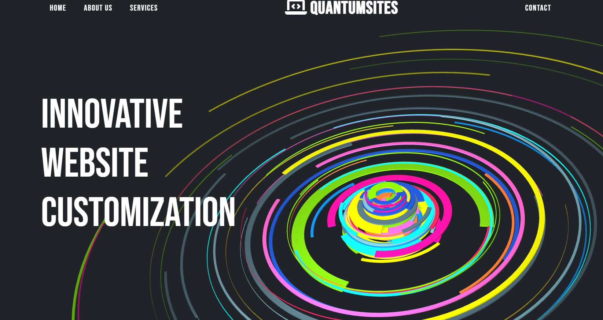

# Freelance-Portfolio

## Description

This repository changed from a freelance portfolio to a website that sells websites. I created it as a business outline, as well as good front-end development work. It is a complete website with everything except a hosting service and a domain. I learned a lot about page spacing, and how to captivate the viewers. 

## Installation

To install this project you would just need to npm install the dependencies and run it. To view, just use localhost or a live server. 

## Usage

To navigate through the website, simply use the navbar at the top of the page and it will take you to different pages. Besides that, scroll down through each page and explore the links assossiated. 

## Credits

Zachary Barnes (myself) - https://github.com/TooSparky?tab=repositories

## License

MIT License
